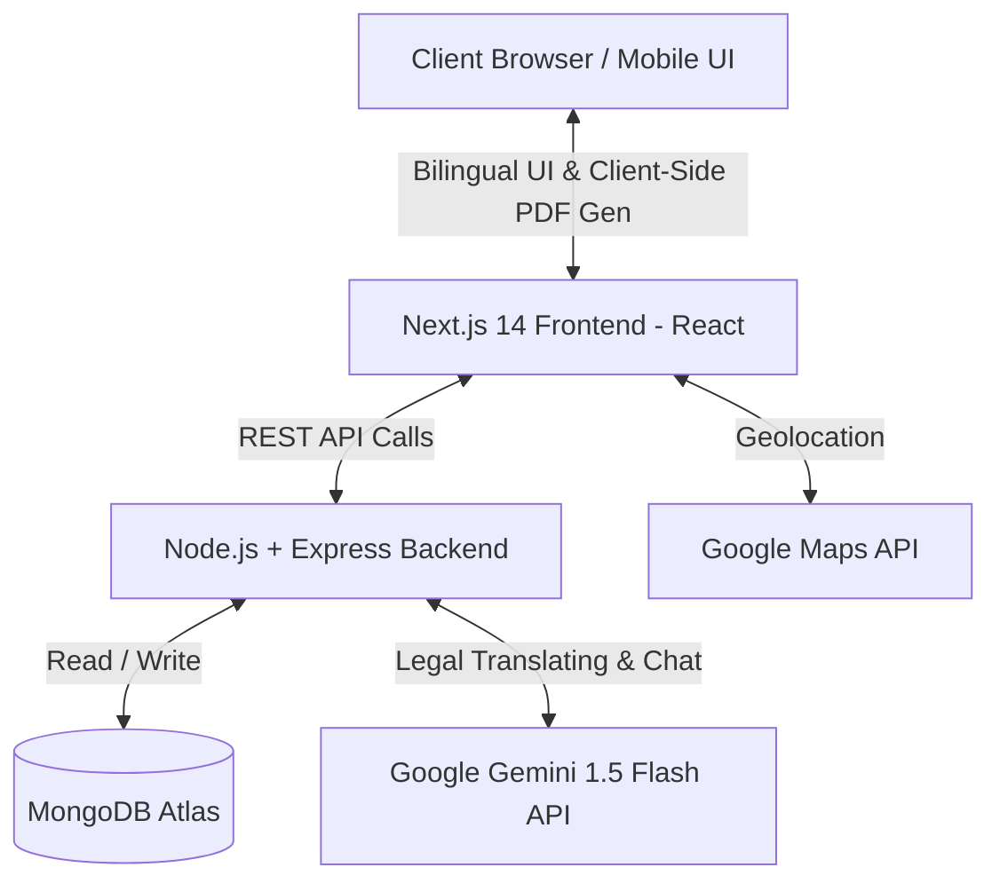
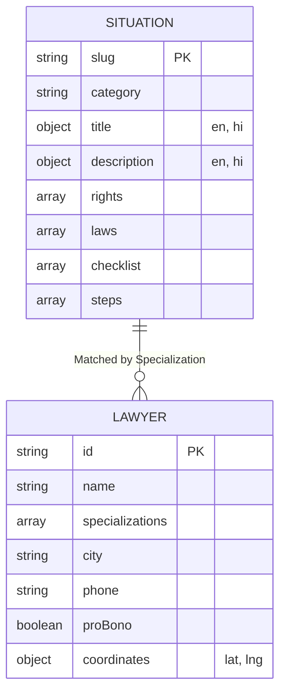

# NyayaMitra: AI-Enhanced Legal Aid Platform for First-Generation Litigants

**Live Working Demo Link:** `[ Insert Vercel/Render Link Here ]`

**Screenshots / Screen Recording:**
`[ Insert Screenshots / Demo Video Link Here ]`

---

## 👥 Project Title & Team Details
**Project Title:** AI-Enhanced Legal Aid Platform for First-Generation Litigants  
**Team Name:** Team NyayaMitra  
**Team Members:**
- Swayam Garg
- Yuvraj Pandiya
- Ajay Sahani
- Nikhil Singh Rajput

---

## 🎯 Problem Statement Overview
**Selected Problem (WD-04):** Build a legal aid web platform.

**Core Solution Approach:**  
India has over 45 million pending court cases, leaving first-generation litigants overwhelmed by legal jargon and complex procedures. Our platform, **NyayaMitra**, solves this by providing a categorised **Legal Situation Selector** (e.g., Landlord Dispute, Consumer Complaint, FIR Filing). 

When a user selects a life event, the platform:
1. **Explains Legal Rights** in plain language (Hindi & English) dynamically using AI, alongside the actual legal text.
2. Generates an interactive **Document Checklist** and **Step-by-Step Procedure**.
3. Features a map-based **Legal Aid Directory** connecting users with nearby pro bono lawyers and NALSA clinics.
4. Includes a **Document Template Generator** that automatically produces filled-in legal notices, complaints, or RTI applications ready for download.

---

## 🏗 Technical Documentation (+3 Bonus Points Criteria)

### 1. Architecture Diagram


### 2. System Workflow / User Flow
*Eraser Prompt for diagram generation:*
```text
// Eraser.io Prompt
User Activity [icon: user] > Home Page [icon: home]
Home Page > Select Language (English/Hindi) [icon: globe]
Select Language > Situation Selector [icon: grid]
Situation Selector > Select Legal Issue (e.g., FIR, Consumer) [icon: file-text]
Select Legal Issue > Rights Explainer (AI vs Original Law) [icon: book-open]
Rights Explainer > Step-by-Step Procedure [icon: list]
Step-by-Step Procedure > Generates Document Checklist [icon: check-circle]
Generates Document Checklist > Action Decision [icon: git-branch]
Action Decision > Lawyer Directory (Map View) [icon: map-pin]
Action Decision > Document Generator (Auto-fill PDF) [icon: download]
```

### 3. Setup and Installation Instructions

**Prerequisites:** Node.js (v18+) and npm.

**Step 1: Clone the repository**
```bash
git clone https://github.com/Swayam7Garg/Project_Legal.git
cd Project_Legal
```

**Step 2: Backend Setup**
```bash
cd backend
npm install
npm run dev
# Server runs on http://localhost:5000
```

**Step 3: Frontend Setup**
```bash
cd ../frontend
npm install
npm run dev
# App runs on http://localhost:3000
```

### 4. Folder Structure Explanation
```text
Project_Legal/
├── backend/                  # Node.js + Express API
│   ├── src/
│   │   ├── models/           # Mongoose schemas (Situations, Lawyers)
│   │   ├── routes/           # Endpoints for AI, Lawyers, Situations
│   │   └── services/         # LLM LangChain integration
├── frontend/                 # Next.js 14 React Application
│   ├── app/                  # App Router (Pages: /situations, /lawyers, /translate)
│   ├── components/           # Reusable UI (Earthen Theme, Maps, Chatbots)
│   ├── data/                 # JSON static structures & Dummy Data
│   ├── lib/                  # jsPDF Logic for Document Generation
│   └── locales/              # i18next dictionaries (English & Hindi)
```

### 5. Environment Variables
Provide the following variables in their respective directories.

**`backend/.env`**
```env
PORT=5000
NODE_ENV=development
MONGODB_URI=mongodb+srv://<username>:<password>@cluster.mongodb.net/test
GEMINI_API_KEY=your_gemini_api_key_here
FRONTEND_URL=http://localhost:3000
```

**`frontend/.env.local`**
```env
NEXT_PUBLIC_BACKEND_URL=http://localhost:5000
NEXT_PUBLIC_GOOGLE_MAPS_API_KEY=your_google_maps_key_here
```

### 6. Sample Test Inputs
To verify the application's logic, judges can use the following test data:
- **Simplify Legal Document Input (Translate Feature):**
  > *"Whoever, being in any manner entrusted with property, or with any dominion over property, dishonestly misappropriates or converts to his own use that property, commits criminal breach of trust." (IPC Section 405)*
- **Chatbot / Legal Query:**
  > *"My landlord is refusing to return my security deposit of ₹20,000 even though I gave proper notice. Check my rights."*
- **Map Location Testing:** Filter by "Indore" to see the custom integrated hardcoded legal aid clinics and synthetic lawyer data.

---

## 🗄 Domain-Specific Requirements

### Database Schema (ERD)


### Role-Based Access Logic
Because NyayaMitra is fundamentally designed as a **public-good Legal Aid platform**, all core resources (rights explanations, chatbots, maps, document generation) are exposed via **Public User Access** to ensure maximum reach for marginalized communities without the friction of authentication. 
*Note: In future production iterations, an `Admin` role will be introduced specifically to continuously update verified legal laws, schemes, and the Pro Bono Lawyer Directory.*

---

## ⚖️ Technical Ethics & Transparency

### AI Usage Declaration
- **Google Gemini 1.5 Flash:** Used extensively via LangChain in the backend for the "Simplify Document" feature, interactive legal chatbot, and context-aware plain-English/Hindi rights explanations.
- **GitHub Copilot / Cursor AI:** Used as pair-programming assistants during the hackathon to accelerate React component boilerplate generation, CSS styling, and debugging frontend build errors.
- *Strict Prompt Constraints:* Our AI integration utilizes aggressive system instructions to ensure the LLM **does not hallucinate laws**, strictly formats output at an 8th-grade reading level, and explicitly declares: *"This is legal information, not legal advice."*

### Data Sources & Synthetic Data
- **Real Legal Sources:** Situation laws, rights, and NALSA structures are referenced from **IndiaCode (indiacode.nic.in)** and **NALSA (nalsa.gov.in)**.
- **Synthetic Data Declaration:** We explicitly used **synthetic (dummy) data** for populating the Lawyer Directory (specifically the Indore, MP entries and placeholder names/numbers like "Advocate Rajesh Sharma") for testing the map plotting and filtering logic safely. Delhi legal aid coordinates map to real public addresses for demonstration purposes.
